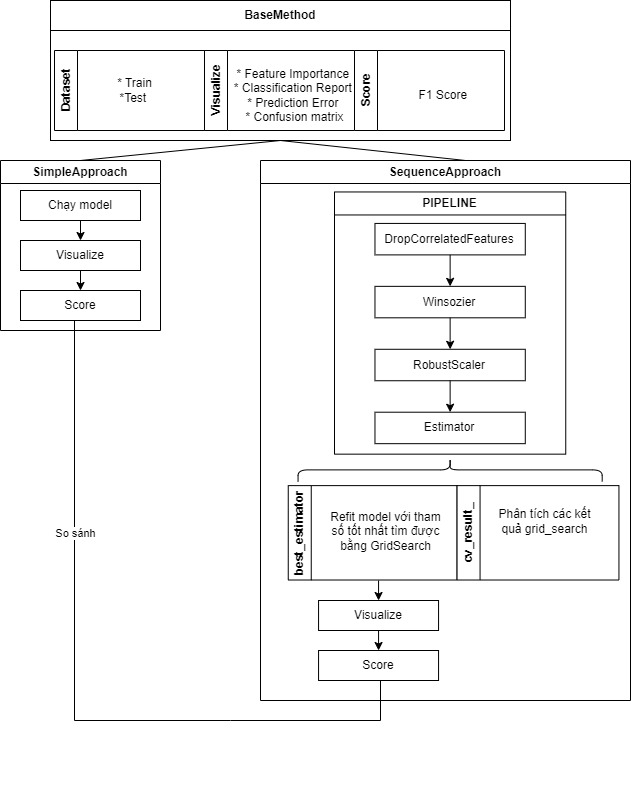

# Project_P4DS

## About
Là project cuối kì môn Python For Data Science của Trường Đại Học Khoa Học Tự Nhiên Thành Phố Hồ Chí Minh
## I. Giới Thiệu Dự Án: Phân Loại Các Loại Đậu Sử Dụng Machine Learning Truyền Thống

### 1. Mục Tiêu Dự Án

Dự án này nhằm mục đích phát triển một hệ thống phân loại các loại đậu sử dụng các thuật toán machine learning truyền thống. Mục tiêu chính là xây dựng một hệ thống có khả năng phân biệt giữa các loại đậu dựa trên các đặc điểm về hình dạng, màu sắc và cấu trúc.

### 2. Tầm Quan Trọng

Việc phân loại các loại đậu là một thách thức quan trọng trong nhiều lĩnh vực như nông nghiệp, thực phẩm và y tế. Hiểu rõ được loại đậu cụ thể sẽ giúp cải thiện quản lý nông nghiệp, chất lượng thực phẩm và phát hiện các vấn đề liên quan đến sức khỏe con người.

### 3. Phương Pháp

Trong dự án này, chúng tôi sẽ sử dụng các thuật toán machine learning truyền thống như:

- **Random Forest**: Sử dụng để xây dựng một rừng cây quyết định để phân loại các loại đậu dựa trên các đặc điểm.
  
- **Logistic Regression**: Sử dụng để ước lượng xác suất của mỗi loại đậu dựa trên các biến đầu vào.
  
- **K Nearest Neighbor (KNN)**: Sử dụng để phân loại các điểm dữ liệu dựa trên việc tính toán khoảng cách từ mỗi điểm đến các điểm lân cận nhất.
  
- **Support Vector Machine (SVM)**: Sử dụng để tìm ra ranh giới phân chia tối ưu giữa các loại đậu trong không gian đặc trưng.

### 4. Dữ Liệu

Chúng tôi sẽ sử dụng một tập dữ liệu chứa các thông số của các loại đậu khác nhau (đã được chuyển từ hình ảnh sang số liệu), được gán nhãn đúng. Dữ liệu này sẽ được tiền xử lý để trích xuất các đặc trưng quan trọng như màu sắc, hình dạng và kích thước của đậu.

### 5. Kết Quả Dự Kiến

Kết quả của dự án này sẽ là một hệ thống có khả năng phân loại các loại đậu với độ chính xác cao. Điều này sẽ giúp cải thiện quản lý nông nghiệp, đảm bảo chất lượng thực phẩm và hỗ trợ trong việc phát hiện các vấn đề sức khỏe liên quan.

### 6. Ý Nghĩa

Dự án này không chỉ mang lại giá trị trong lĩnh vực nghiên cứu và phát triển công nghệ mà còn có thể ứng dụng rộng rãi trong thực tế, góp phần nâng cao chất lượng cuộc sống và phát triển bền vững.

## II. Road Map



### Các kĩ thuật tiền xử lý dữ liệu trước khi huấn luyện mô hình

1. **DropCorrelatedFeatures (Loại bỏ Đặc Điểm Tương Quan)**:
   - **Mục Đích**: Loại bỏ các đặc điểm có mức độ tương quan cao với nhau.
   - **Áp Dụng**: Các đặc điểm tương quan cao có thể làm gia tăng độ phức tạp của mô hình và dẫn đến hiện tượng overfitting. Loại bỏ chúng giúp giảm chiều của không gian đặc trưng và cải thiện hiệu suất của mô hình.

2. **Winsorizer (Winsorization)**:
   - **Mục Đích**: Giảm ảnh hưởng của các giá trị ngoại lệ bằng cách cắt các giá trị lớn nhất và nhỏ nhất trong phân phối.
   - **Áp Dụng**: Các giá trị ngoại lệ có thể ảnh hưởng đến việc huấn luyện mô hình bằng cách tạo ra các ảnh hưởng không mong muốn. Winsorization giúp làm giảm tác động của ngoại lệ và cải thiện tính ổn định của mô hình.

3. **RobustScaler (Trình Chỉnh Sửa Robust)**:
   - **Mục Đích**: Chuẩn hóa dữ liệu bằng cách loại bỏ ảnh hưởng của giá trị ngoại lệ.
   - **Áp Dụng**: Trong khi StandardScaler và MinMaxScaler nhạy cảm với ngoại lệ, RobustScaler làm giảm ảnh hưởng của chúng bằng cách sử dụng các phương pháp như trung vị và phần tư vị. Điều này làm cho nó phù hợp hơn với dữ liệu có nhiều ngoại lệ.

4. **SMOTE (Synthetic Minority Over-sampling Technique)**:
   - **Mục Đích**: Tăng cường số lượng mẫu trong lớp thiểu số bằng cách tạo ra các mẫu tổng hợp.
   - **Áp Dụng**: Khi dữ liệu không cân bằng, tức là một lớp chiếm đa số trong khi lớp khác chiếm ít hơn, mô hình có thể có xu hướng học cách phân loại chính xác các mẫu trong lớp đa số nhưng không tốt đối với lớp thiểu số. SMOTE giúp cân bằng lại dữ liệu và cải thiện khả năng phân loại của mô hình trên lớp thiểu số.

<!-- Các kỹ thuật này có thể được kết hợp và áp dụng trong quy trình tiền xử lý dữ liệu trước khi huấn luyện mô hình machine learning, nhằm cải thiện hiệu suất và tính ổn định của mô hình. -->

### Các kĩ thuật xây dựng mô hình

- `GridSearchCV` được sử dụng để tìm kiếm qua lưới các siêu tham số được định nghĩa trong `parameters`.
- `cv=5` chỉ định kỹ thuật cross-validation sử dụng 5-fold cross-validation.
- Sau khi tìm kiếm kết thúc, `grid_search.best_params_` cung cấp thông số tốt nhất và `grid_search.best_score_` là điểm số tốt nhất đạt được trên tập huấn luyện.
- Cuối cùng, mô hình được đánh giá trên tập kiểm tra để xác nhận hiệu suất của nó.

`GridSearchCV` với `Pipeline` là 2 công cụ mạnh mẽ để tìm kiếm siêu tham số và xây dựng một quy trình hoàn chỉnh từ tiền xử lý dữ liệu đến huấn luyện mô hình

### Các phương pháp đánh giá

1. **Confusion Matrix (Ma trận nhầm lẫn)**:
   - Confusion matrix là một bảng chứa thông tin về các dự đoán của mô hình so với nhãn thực tế.
   - Các phần tử chính đường chéo của confusion matrix biểu thị số lượng các dự đoán chính xác.
   - Các phần tử ngoài đường chéo là các sai lầm mà mô hình đã thực hiện, chẳng hạn như False Positive (dự đoán sai nhãn Positive) và False Negative (dự đoán sai nhãn Negative).

2. **Classification Report**: cung cấp một báo cáo tổng quan về hiệu suất của mô hình, bao gồm precision, recall và f1-score của mỗi lớp.
   <!-- - Precision đo lường tỷ lệ dự đoán đúng của một lớp so với tổng số các dự đoán thuộc lớp đó.
   - Recall đo lường tỷ lệ dự đoán đúng của một lớp so với tổng số các mẫu thực sự thuộc lớp đó.
   - F1-score là một số điểm trung hòa giữa precision và recall, được tính bằng công thức: 2 * (precision * recall) / (precision + recall). -->

    **Precision (Độ chính xác)**: là tỷ lệ số lượng dự đoán đúng thuộc lớp Positive so với tổng số dự đoán thuộc lớp Positive (bao gồm cả True Positive và False Positive).Precision cao hơn chỉ ra rằng mô hình ít gây ra các dự đoán False Positive.

    **Recall (Độ phủ)**: Recall là tỷ lệ số lượng dự đoán đúng thuộc lớp Positive so với tổng số mẫu thực sự thuộc lớp Positive (bao gồm cả True Positive và False Negative).Recall cao hơn chỉ ra rằng mô hình có khả năng phát hiện nhiều điểm dữ liệu Positive hơn.

    **F1-score**: F1-score là một số điểm trung hòa giữa precision và recall, là một phép đo tổng thể về hiệu suất của mô hình.F1-score cao hơn chỉ ra rằng mô hình có sự cân bằng tốt giữa precision và recall.

Các phương pháp này cung cấp cái nhìn tổng quan về hiệu suất của một mô hình machine learning và giúp hiểu rõ hơn về cách mà mô hình đang hoạt động trên dữ liệu thực tế.

### Kết luận

**Về model :**  

* Giai đoạn tiền xử lý dữ liệu đóng vai trò rất quan trọng trong việc xây dựng mô hình, cũng như quyết định đến hiệu năng của mô hình 
* Với 3 mô hình là Logistic Regression, Support Vector Machine và K-nearest neighbor , hiệu năng bị ảnh hưởng rất nhiều bởi các bước tiền xử lý dữ liệu. Nguyên nhân là do 3 mô hình này sử dụng các hàm toán học dựa trên khoảng cách giữa các điểm để tính toán và đánh giá, nên việc không xử lý dữ liệu ban đầu ( dữ liệu bị nhiễu, không được chuẩn hóa, ngoại lai) dẫn đến tính toán bị sai lệch, làm điểm số sụt giảm nghiêm trọng. 
* Với random forest, mô hình không xét trên tương quan của đặc trưng mà dùng việc phân chia để quyết định kết quả nên việc tổng hợp nhiều cây làm hạn chế nhược điểm của các quyết định con.  
* Tỉ lệ thành công cao ở tất cả phương pháp đánh giá (accuracy, precision, recall, f1) cho thấy mô hình đã khá thành công trong việc phân loại các loại đậu. 
* Tất cả các mô hình đều bị nhầm lẫn khá nhiều trong việc phân loại 2 loại đậu là Sira và Demarson, điều này là bởi vì 2 loại đậu này có độ phẳng và độ tròn gần như tương đồng nhau, từ đó gây khó khăn cho việc phân loại. Nếu khắc phục được vấn đề này, điểm số của các mô hình sẽ tăng lên rất cao. 

**Về mặt hạn chế  :** 

* Qua quá trình xây dựng và đánh giá mô hình vẫn một vài khó khăn gặp phải như việc xử lí outliers cho từng loại đậu trong các đặc trưng thay vì chỉ xử lí tổng quát làm mất ý nghĩa của dữ liệu có thể thí dụ như class Bombay có kích thước to hơn so với nhóm còn lại nhưng khi xét tổng quát cho 1 đặc trưng các thông số thông kế nhận diện Bombay là những outliers. 

**Hướng phát triển trong tương lai :**  

* Khắc phục outliers bằng kĩ thuật học không giám sát (clustering) cho việc nhóm class thay vì sử dụng mặc định các class sẽ xảy ra tình huống dữ liệu mới không thuộc class nào trong dữ liệu nhưng bị nhằm lẫn do có cùng kích thước với các class (chưa có cơ sở)
* Khắc phục sự nhầm lẫn giữa hai loại đậu là Sira và Demarson bằng các thuật toán học sâu. 


# Cài đặt thư viện
```bash
pip install -r requirement.txt
```
